<div align="center">

  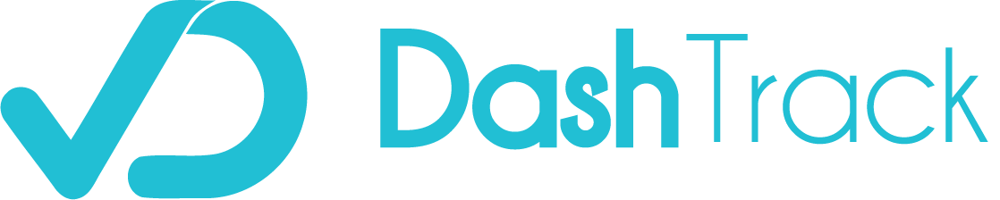
  <h1>DashTrack Task Management System</h1>
  
  <p>
    Web-based Open Source Team and Project Management Software 
  </p>
  
  
<!-- Badges -->
<p>
  <a href="https://github.com/johannesteshome/dashtrack-task-management-system/network/members">
    
  </a>
  <a href="https://github.com/johannesteshome/dashtrack-task-management-system/stargazers">
    
  </a>
  <a href="https://github.com/johannesteshome/dashtrack-task-management-system/issues/">
    
  </a>
</p>
   
<h4>
    <a href="https://dashtrack-task-management-system.vercel.app/">View Demo</a>
  <span> · </span>
    <!-- <a href="https://github.com/Louis3797/awesome-readme-template">Documentation</a>
  <span> · </span> -->
    <a href="https://github.com/Louis3797/awesome-readme-template/issues/">Report Bug</a>
  <span> · </span>
    <a href="https://github.com/Louis3797/awesome-readme-template/issues/">Request Feature</a>
  </h4>
</div>

<br />

<!-- Table of Contents -->
# :notebook_with_decorative_cover: Table of Contents

- [:blue_book: Table of Contents]()
  - [:star2: About the Project](#star2-about-the-project)
    - [:camera: Screenshots](#camera-screenshots)
    - [:space_invader: Tech Stack](#space_invader-tech-stack)
    - [:dart: Features](#dart-features)
    - [:art: Color Reference](#art-color-reference)
    <!-- - [:key: Environment Variables](#key-environment-variables) -->
  - [:toolbox: Getting Started](#toolbox-getting-started)
    - [:bangbang: Prerequisites](#bangbang-prerequisites)
    - [:gear: Installation](#gear-installation)
    <!-- - [:test_tube: Running Tests](#test_tube-running-tests) -->
    - [:running: Run Locally](#running-run-locally)
    <!-- - [:triangular_flag_on_post: Deployment](#triangular_flag_on_post-deployment) -->
  <!-- - [:eyes: Usage](#eyes-usage) -->
  - [:compass: Roadmap](#compass-roadmap)
  - [:wave: Contributing](#wave-contributing)
    <!-- - [:scroll: Code of Conduct](#scroll-code-of-conduct) -->
  <!-- - [:grey\_question: FAQ](#grey_question-faq) -->
  <!-- - [:warning: License](#warning-license) -->
  - [:handshake: Contact](#handshake-contact)
  - [:gem: Acknowledgements](#gem-acknowledgements)

  

<!-- About the Project -->
## :star2: About the Project
DashTrack is a comprehensive task management system built using the MERN stack (MongoDB, Express.js, React.js, and Node.js) along with Socket.io for real-time communication. The system provides a range of features including a calendar view, kanban board view, list view, real-time chat, and notifications, making it a versatile solution for managing project tasks and collaboration.


<!-- Screenshots -->
### :camera: Screenshots

<div align="center"> 
  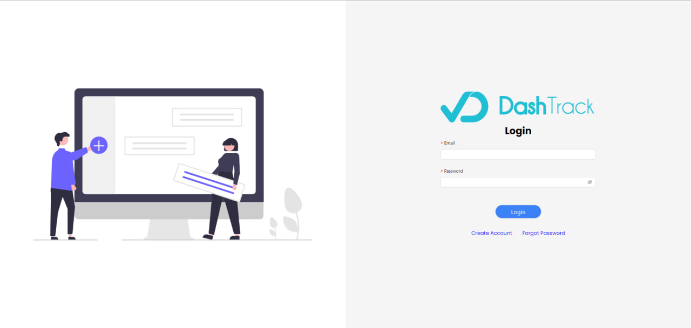
  <p>Login Page</p>
</div>
<div align="center"> 
  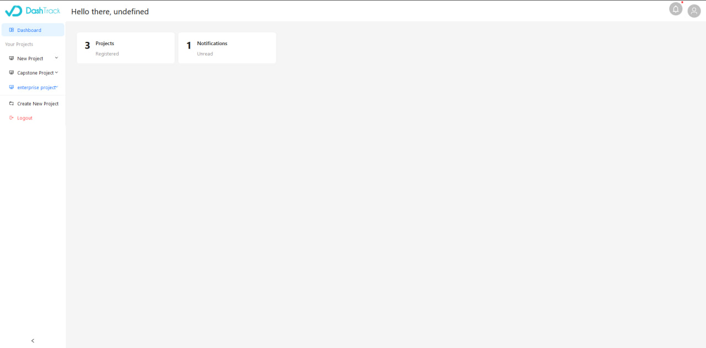
  <p>Dashboard Page</p>
</div>
<div align="center"> 
  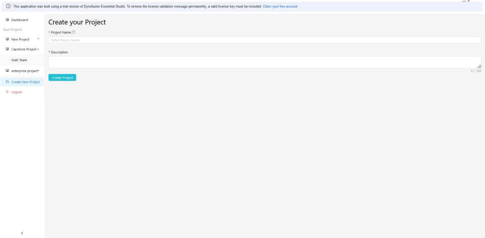
  <p>Creating a Project</p>
</div>
<div align="center"> 
  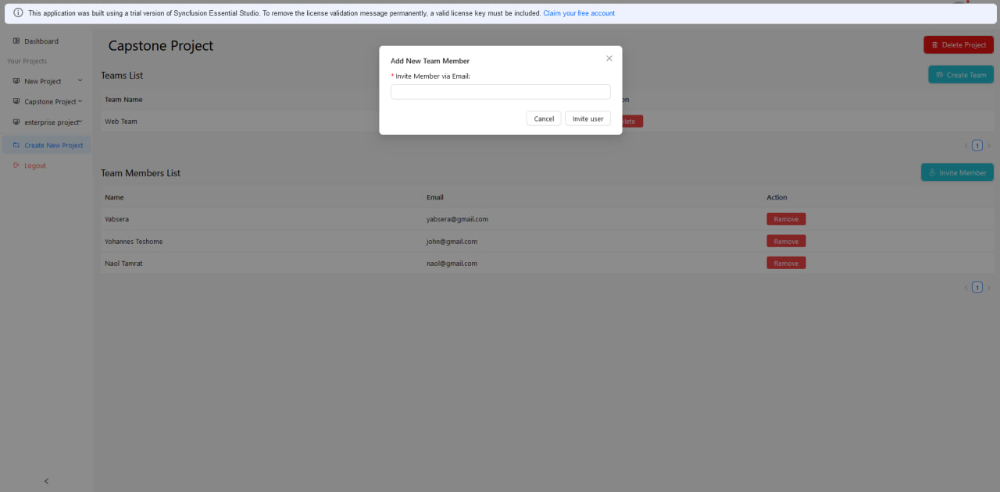
  <p>Inviting a Team Member via Email</p>
</div>
<div align="center"> 
  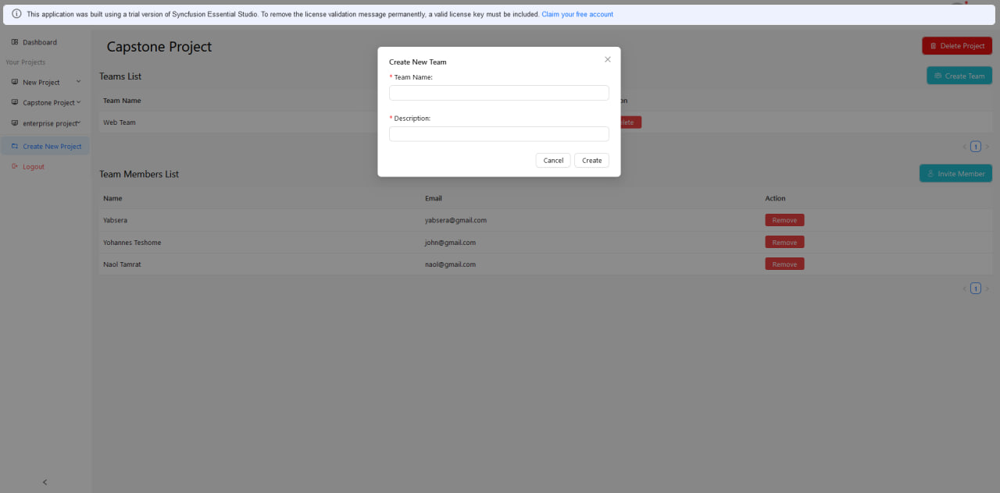
  <p>Creating a Team</p>
</div>
<div align="center"> 
  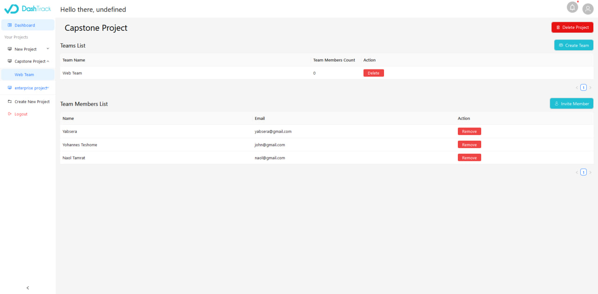
  <p>Project Members and Teams List</p>
</div>
<div align="center"> 
  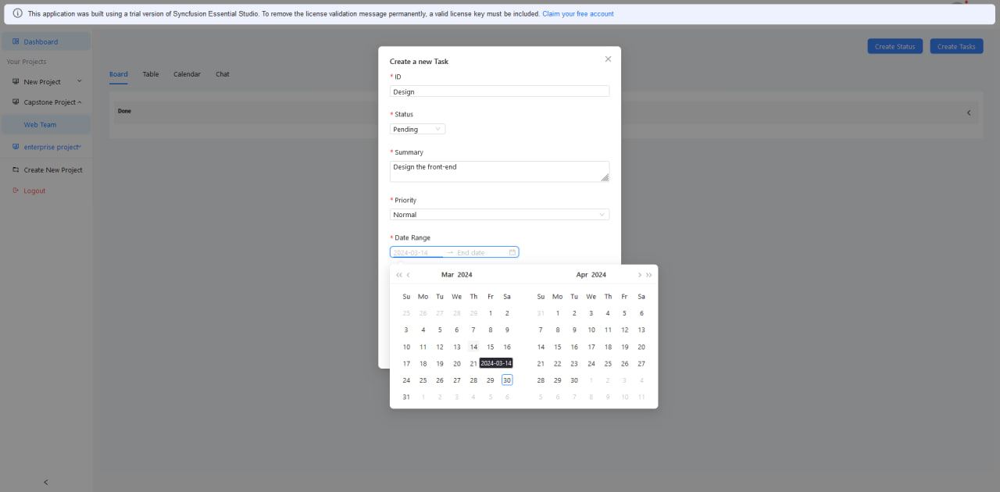
  <p>Creating a Task</p>
</div>
<div align="center"> 
  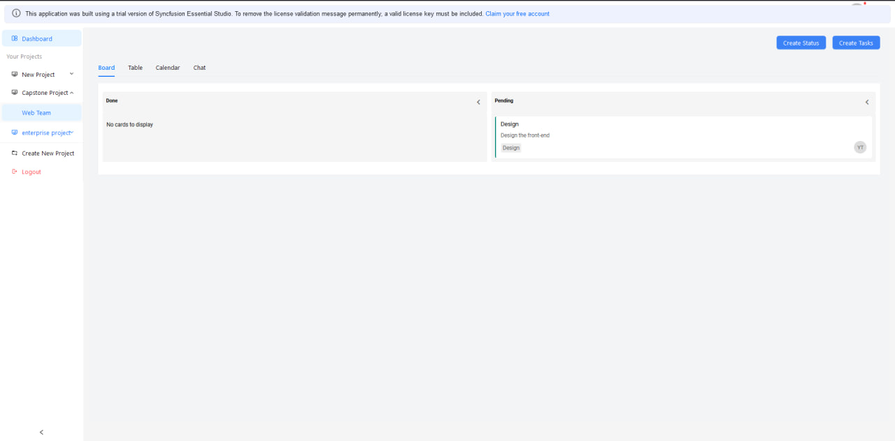
  <p>Kanban Board View of Tasks</p>
</div>
<div align="center"> 
  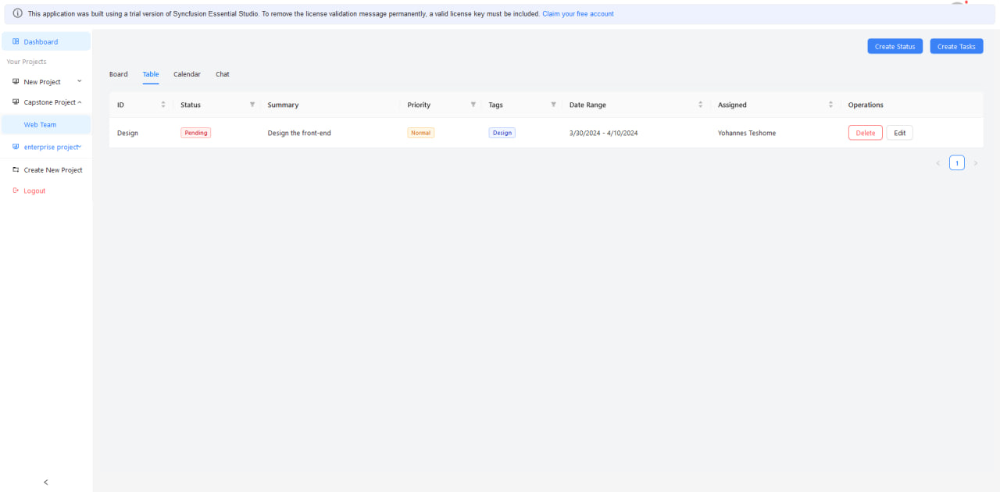
  <p>Table List View of Tasks</p>
</div>
<div align="center"> 
  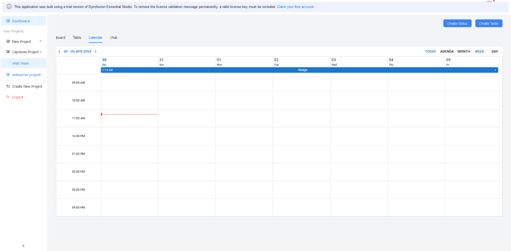
  <p>Calendar View of Tasks</p>
</div>
<div align="center"> 
  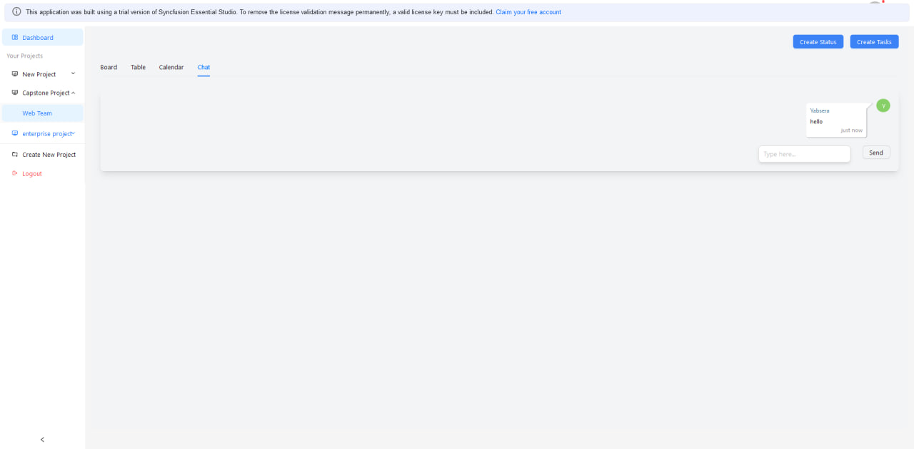
  <p>Team Chat</p>
</div>
<div align="center"> 
  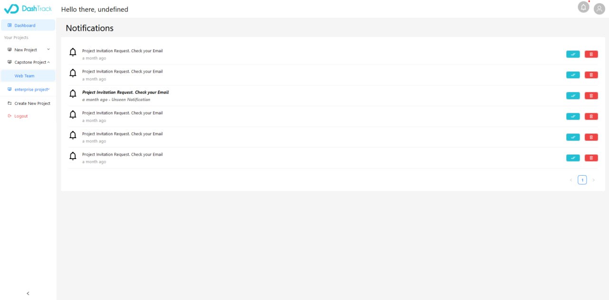
  <p>Notifications Page View</p>
</div>
<div align="center"> 
  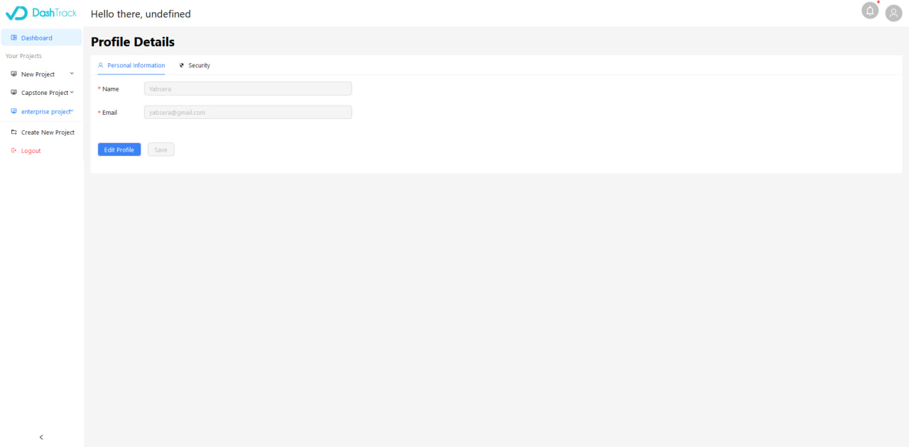
  <p>Profile Page</p>
</div>


<!-- TechStack -->
### :space_invader: Tech Stack

These are the technologies and frameworks used to build this project.

* [![React][React.js]][React-url]
* [![Redux][Redux]][Redux-url]
* [![Node][Node]][Node-url]
* [![MongoDB][MongoDB]][MongoDB-url]
* [![Expressjs][Expressjs]][Expressjs-url]
* [![Socket.IO][Socket.IO]][Socket.IO-url]
* [![Postman][Postman]][Postman-url]
* [![AntD][AntD]][AntD-url]


<!-- Features -->
### :dart: Features

- **User Invitation**: The system provides an email-based invitation system, allowing project members to invite colleagues or stakeholders to join a specific project. Invited members receive an email containing an invitation link, which grants them access to the project and its associated tasks.

- **Team Formation**: Users can form teams within a project to improve collaboration and streamline task assignment. Team members can be grouped together based on their roles, responsibilities, or areas of expertise. This feature enhances communication and coordination among team members working on the same project.

- **Robust Security Measures**: includes features such as one-time passwords (OTPs) for user authentication, ensuring that only authorized individuals can access the system. Additionally, user verification mechanisms add an extra layer of security by validating user identities.

- **Task Assignment**: Project managers or team leaders can assign tasks to specific users or teams within the project. This feature streamlines task distribution, ensuring that responsibilities are clearly defined and assigned to the appropriate individuals or groups.

- **Task Priority Setting**: Users can set priority levels for tasks to indicate their importance or urgency. This feature helps in organizing and managing tasks effectively, allowing team members to focus on critical tasks and meet project deadlines efficiently.
- Multiple Tasks View Options
    - **Calendar View**: The system offers a user-friendly calendar view that allows users to visualize tasks and deadlines in a monthly, weekly, or daily format. It provides an intuitive interface for managing task schedules and tracking progress.

    - **Kanban Board View**: With the kanban board view, users can organize tasks into different columns such as "To Do," "In Progress," and "Done." This visual representation helps teams to easily manage and track the status of tasks throughout the project lifecycle.

    - **List View**: The list view provides a straightforward and convenient way to manage tasks in a linear format. Users can create, edit, and prioritize tasks, ensuring an efficient workflow and task management process.

- **Real-time Chat**: The integrated real-time chat feature enables seamless communication and collaboration among team members. Users can initiate group chats, create private conversations, share files, and discuss task-related details in real-time.

- **Notifications**: The system keeps users informed about important updates and activities through real-time notifications. Users receive notifications for task assignments, due date reminders, comments, and other relevant events, ensuring that everyone stays up to date with the project's progress.
<!-- Color Reference -->
### :art: Color Reference

| Color             | Hex                                                                |
| ----------------- | ------------------------------------------------------------------ |
| Primary Color |  #222831 |
| Secondary Color |  #393E46 |
| Accent Color |  #00ADB5 |
| Text Color |  #EEEEEE |


<!-- Env Variables -->
<!-- ### :key: Environment Variables

To run this project, you will need to add the following environment variables to your .env file

`API_KEY`

`ANOTHER_API_KEY` -->

<!-- Getting Started -->
## 	:toolbox: Getting Started

<!-- Prerequisites -->
### :bangbang: Prerequisites

This project uses npm as package manager

```bash
 npm -v
```

<!-- Installation -->
<!-- ### :gear: Installation

Install my-project with npm

```bash
  npm install
  cd my-project
``` -->
   
<!-- Running Tests -->
<!-- ### :test_tube: Running Tests

To run tests, run the following command

```bash
  yarn test test
``` -->

<!-- Run Locally -->
### :running: Run Locally

Clone the project

```bash
  git clone https://github.com/johannesteshome/dashtrack-task-management-system.git
```

Go to the project directory

```bash
  cd dashtrack-task-management-system
```

Install dependencies for each front-end and back-end

```bash
  cd frontend
  npm install
```

Start the server

```bash
  cd backend
  npm install
  npm run dev
```


<!-- Deployment
### :triangular_flag_on_post: Deployment

To deploy this project run

```bash
  yarn deploy
``` -->


<!-- Usage -->
<!-- ## :eyes: Usage

Use this space to tell a little more about your project and how it can be used. Show additional screenshots, code samples, demos or link to other resources.


```javascript
import Component from 'my-project'

function App() {
  return <Component />
}
``` -->

<!-- Roadmap -->
## :compass: Roadmap

* [x] Team Chat
* [x] Kanban View of Tasks
* [ ] Mobile Responsiveness
* [ ] Google Calendar Integration


<!-- Contributing -->
## :wave: Contributors


Contributions are what make the open source community such an amazing place to learn, inspire, and create. Any contributions you make are **greatly appreciated**.

If you have a suggestion that would make this better, please fork the repo and create a pull request. You can also simply open an issue with the tag "enhancement".
Don't forget to give the project a star! Thanks again!

1. Fork the Project
2. Create your Feature Branch (`git checkout -b feature/AmazingFeature`)
3. Commit your Changes (`git commit -m 'Add some AmazingFeature'`)
4. Push to the Branch (`git push origin feature/AmazingFeature`)
5. Open a Pull Request

<a href="https://github.com/johannesteshome/dashtrack-task-management-system/graphs/contributors">
  
</a>


Contributions are always welcome!

<!-- See `contributing.md` for ways to get started. -->


<!-- Code of Conduct -->
<!-- ### :scroll: Code of Conduct

Please read the [Code of Conduct](https://github.com/Louis3797/awesome-readme-template/blob/master/CODE_OF_CONDUCT.md)

<!-- FAQ -->
<!-- ## :grey_question: FAQ

- Question 1

  + Answer 1

- Question 2

  + Answer 2 -->


<!-- License -->
<!-- ## :warning: License -->

<!-- Distributed under the no License. See LICENSE.txt for more information. --> 


<!-- Contact -->
## :handshake: Contact

[Yohannes Teshome](https://github.com/johannesteshome) - [@linkedin](https://linkedin.com/yohannes-teshome) - yohannesteshome632@gmail.com
Yabsera Haile - [@linkedin](https://linkedin.com/yohannes-teshome) - yabserahaile@gmail.com
Haymanot Demis - [@linkedin](https://linkedin.com/yohannes-teshome) - haymedin21@gmail.com

Project Link: [Here](https://github.com/johannesteshome/dashtrack-task-management-system/)


<!-- Acknowledgments -->
## :gem: Acknowledgements

We would like to thank the following resources and websites that helped us in building this project

 - [Shields.io](https://shields.io/)
 - [Awesome README](https://github.com/matiassingers/awesome-readme)
 - [Emoji Cheat Sheet](https://github.com/ikatyang/emoji-cheat-sheet/blob/master/README.md#travel--places)
 - [Readme Template](https://github.com/othneildrew/Best-README-Template)


[React.js]: https://img.shields.io/badge/React-js-20232A?style=for-the-badge&logo=react&logoColor=61DAFB
[React-url]: https://reactjs.org/
[Redux]: https://img.shields.io/badge/redux-toolkit-7248B6?style=for-the-badge&logo=redux&logoColor=red
[Redux-url]: https://redux-toolkit.js.org/
[Node]: https://img.shields.io/badge/node-js-7EC729?style=for-the-badge&logo=nodedotjs&logoColor=blue
[Node-url]: https://nodejs.org/en
[MongoDB]: https://img.shields.io/badge/mongo-db-0FA54D?style=for-the-badge&logo=mongodb&logoColor=blue
[MongoDB-url]: https://www.mongodb.com/
[Socket.IO]: https://img.shields.io/badge/socket-io-010101?style=for-the-badge&logo=socketdotio&logoColor=green
[Socket.IO-url]: https://socket.io/
[ExpressJS]: https://img.shields.io/badge/express-js-7E7E7E?style=for-the-badge&logo=express&logoColor=blue
[ExpressJS-url]: https://expressjs.com/
[AntD]: https://img.shields.io/badge/ant-design-EE3D4E?style=for-the-badge&logo=antdesign&logoColor=blue
[AntD-url]: https://ant.design/
[Postman]: https://img.shields.io/badge/post-man-F76A33?style=for-the-badge&logo=postman&logoColor=blue
[Postman-url]: https://www.postman.com/
